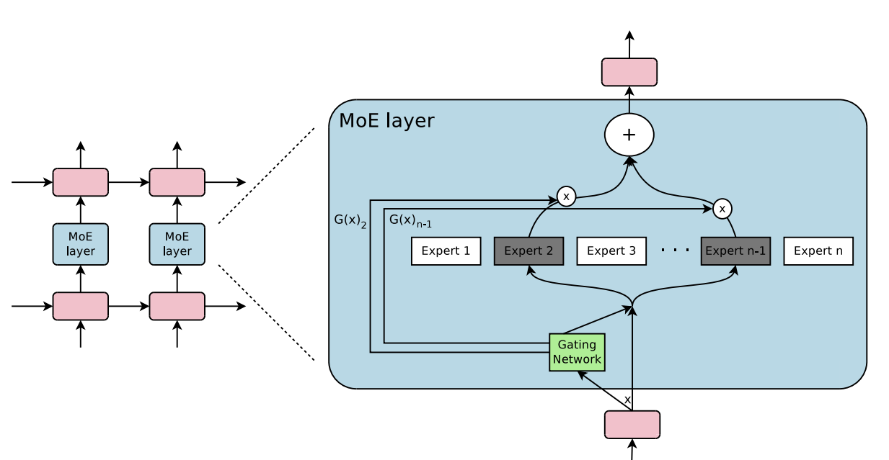

# Mixture of Experts
<figure style="text-align: center;">
  
  <figcaption>Mixture of Experts Layer</figcaption>
</figure>

## Report
The **final report** of this assignment can be found in **[here](report/report.pdf)**.

## Notebooks
- [`conll_notebook.ipynb`](conll_notebook.ipynb) contains all the training of the models trained on the CoNLL-2003 dataset.
- [`squad_notebook.ipynb`](squad_notebook.ipynb) contains all the training of the models trained on the SQuAD 1.1 dataset.
- [`conll_data.ipynb`](data_notebooks/conll_data.ipynb) contains all the data-preprocessing described in the [report](report/report.pdf) for the CoNLL-2003 dataset.
- [`squad_data.ipynb`](data_notebooks/squad_data.ipynb) contains all the data-preprocessing described in the [report](report/report.pdf) for the squad dataset.
## Models
[`models.py`](models.py) contains the code for the different models used. The weights of the models can be found in the [models](models) folder. 
To use them, you'll have to load the weights of the embedding layer:
```python 3
import pickle
import torch

# Load idx2token and token2idx files which are dictionaries.
with open('path/to/idx2token.pkl', 'rb') as file:
    idx2token = pickle.load(file)
with open('path/to/token2idx.pkl', 'rb') as file:
    token2idx = pickle.load(file)

# Load embedding weights.
embedding_weights = torch.load('path/to/weights')
```
### Model Settings
Following is a guide to the different settings used for different models:
- `lstm_baseline.pt`
```python 3
# Non-moe model
BaselineModel(vocab_size = len(idx2token),
              embedding_dim =  50,
              hidden_dim =  128,
              intermediate_expert_dim =  128,
              output_dim = 9,  # This argument is only there for the CoNLL models.
              model_state_dict = embedding_weights,
            )
```
- `moe_baseline.pt`
```python 3
MoEModel(vocab_size = len(idx2token),
         embedding_dim = 50,
         hidden_dim = 128,
         intermediate_expert_dim = 128,
         output_dim = 9, # This argument is only there for the CoNLL models.
         model_state_dict = embedding_weights,
         router: 'top_k',
         num_experts: 8,
         top_k: 2, 
        ) 
```
- `moe_top_k_mask.pt` and `moe_importance_mask.pt`
```python 3
MoEModel(vocab_size = len(idx2token),
         embedding_dim = 50,
         hidden_dim = 128,
         intermediate_expert_dim = 128,
         output_dim = 9, # This argument is only there for the CoNLL models.
         model_state_dict = embedding_weights,
         router: 'top_k_mask',
         num_experts: 8,
         top_k: 2, 
        ) 
```
- `moe_noisy.pt` and `moe_noisy_load.pt`
```python 3
MoEModel(vocab_size = len(idx2token),
         embedding_dim = 50,
         hidden_dim = 128,
         intermediate_expert_dim = 128,
         output_dim = 9, # This argument is only there for the CoNLL models.
         model_state_dict = embedding_weights,
         router: 'noisy_top_k',
         num_experts: 8,
         top_k: 2, 
        ) 
```
### Load Weights
Create `model` variable using the above guide and run the following script:
```python
import torch

weights = torch.load('path/to/weights')['state_dict']
model.load_state_dict(weights)
```


## Assets
### CoNLL-2003:
- [`idx2token.pkl`](conll-assets/idx2token.pkl) and [`token2idx.pkl`](conll-assets/token2idx.pkl) are index to token and token to index mapping respectively.
-  [`conll.glove.6B.50d.pt`](conll-assets/conll.glove.6B.50d.pt) contains the embedding weights used for the CoNLL models.
### SQuAD 1.1:
- [`idx2token.pkl`](squad-assets/idx2token.pkl) and [`token2idx.pkl`](squad-assets/token2idx.pkl) are index to token and token to index mapping respectively.
-  [`squad.glove.6B.50d.pt`](squad-assets/squad.glove.6B.50d.pt) contains the embedding weights used for the SQuAD models.  
- [`train_data.csv`](squad-assets/train_data.csv) contains the training data in csv format.
- [`dev_data.csv`](squad-assets/dev_data.csv) contains validation data in csv format.
### Load Embeddings
You can load the embeddings in the following way.
```python 3
import pickle
import torch

# Load idx2token and token2idx files which are dictionaries.
with open('path/to/idx2token.pkl', 'rb') as file:
    idx2token = pickle.load(file)
with open('path/to/token2idx.pkl', 'rb') as file:
    token2idx = pickle.load(file)
# Load embedding weights.
weights = torch.load('path/to/weights')

vocab_size = len(idx2token)

embedding = nn.Embedding(vocab_size,
                        embedding_dim=50,
                        padding_idx=0)
embedding.load_state_dict(weights)
```

## Mixture of Experts
[`moe.py`](moe.py) contains mixture of experts implementation with different routers. It also has the code for load loss. 
## Tokenizer
[`tokenizer.py`](tokenizer.py) contains the code for custom tokenizer class I wrote for both datasets.
## Datasets
[`dataset.py`](dataset.py) contains the Pytorch dataset classes for both SQuAD and CoNLL datasets.
