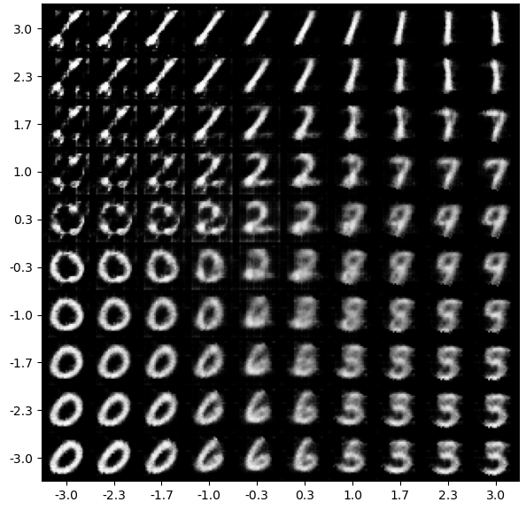

# Variational Autoencoders

<figure style="text-align: center;">
  
  <figcaption>VAE Latent Space</figcaption>
</figure>

## Report
The **final report** of this assignment can be found in **[here](report/report.pdf)**.

## Notebooks
 - [`notebook.ipynb`](notebook.ipynb) entails all the training, plotting I carried out for this assignment.
 - [`classifier_training.ipynb`](classifer_training.ipynb) is where the MNIST classifier used in perceptual loss was trained.

## Models
The code to models can be found in [`models.py`](models.py). The code to the VAEs used and the classifier used, are all in there. The weights of the models can be found in [models](models/) folder. To load the weights, run the following script:
```python 3
import torch
from models import NormalVAE

state_dict = torch.load('path/to/weights')['state_dict']
vae = NormalVAE(2,1,2)
vae.load_state_dict(normal_state_dict)
```
## Trainer 
The code to the custom model trainer for VAEs here can be found in [`trainer.py`](trainer.py).

## Perceptual Loss
The code to perceptual loss and weighted perceptual loss can be found in [`losses.py`](losses.py):

## FID Score
Code that computes the FID Score for a given VAE trained on MNIST dataset can be found in [`fid.py`](fid.py).


